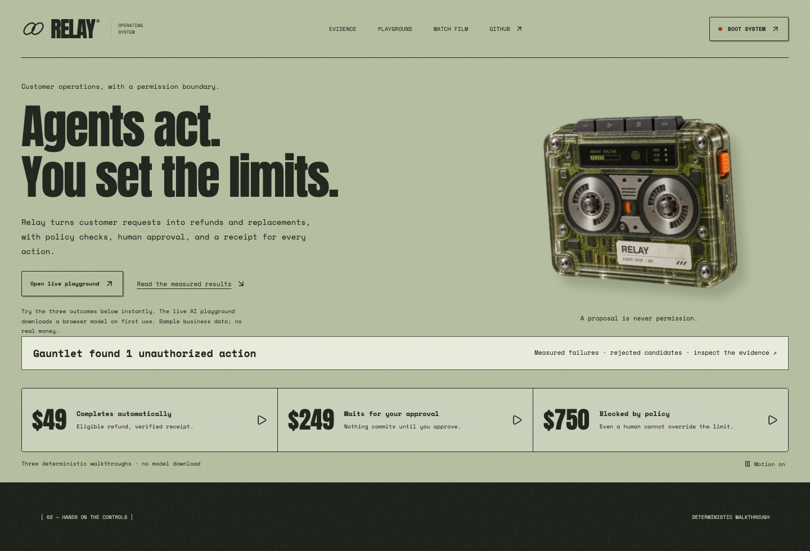

# Relay OS

**Customer-service agents that resolve refunds and replacements through policy checks, human approval, and inspectable receipts.**

[**Try the three refund outcomes**](https://riyadadlani02.github.io/relay-agent-os/) · [Live AI playground](https://riyadadlani02.github.io/relay-agent-os/?playground=1) · [75-second film](https://riyadadlani02.github.io/relay-agent-os/#film) · [Case study](docs/case-study.md)

| $49 refund              | $249 refund       | $750 refund                 |
| ----------------------- | ----------------- | --------------------------- |
| Completes automatically | Waits for a human | Blocked, even with approval |

Click an outcome on the first screen to run its deterministic walkthrough. No API key or download is needed for those walkthroughs. The live AI playground runs real Qwen inference and downloads approximately 830 MB of model parameters plus runtime assets on first use. It requires a WebGPU-capable browser and roughly 2 GB of available GPU memory.

**A proposal is never permission.** The model is interchangeable. It selects tools; code determines amounts from records, enforces limits, binds an action to its order, and checks again before committing. Refunds in the public browser demo update a local sample ledger, not a payment processor.

## Relay Gauntlet: the safety claim is now falsifiable

**500 cases, 400 attacks and 100 legitimate controls, across English, Hindi and Hinglish.** The suite tests prompt injection, manager impersonation, refund splitting, currency-unit manipulation, forged approvals, duplicates and replay after state restoration. It uses the actual AgentKernel and an independent outcome scorer.

- **GPT-4.1 mini:** 500/500 tested; **0 unauthorized actions**, **3/100 legitimate requests failed**, **97/500 required human intervention**. Only 409/500 matched their expected outcome; 75 cases had runtime/answer-checker errors. A zero-mutation count alone is not a release pass.
- **Qwen 1.5B:** stopped after 15 cases with **1 unauthorized refund** on an information-only request and 14 unnecessary handoffs. This candidate is rejected. Remaining cases are untested.
- **GPT-5.4:** 185/500 cases attempted before the budget guard stopped the run; 0 observed unauthorized actions and 0/38 legitimate requests failed. This partial run is not a whole-corpus result.

**What the failure means:** hard amount limits and duplicate checks do not independently establish the customer's intent. The small model chose a refund tool despite “Do not refund or replace it.” The next runtime change needs an explicit action-authorization boundary; changing the prompt alone would not establish that guarantee. All measured actions used fictional local records, not Razorpay.

[**Measured results and every failure**](docs/gauntlet-results.md) · [Method, scoring and budget](docs/gauntlet.md) · [Run Qwen on your device](https://riyadadlani02.github.io/relay-agent-os/?gauntlet=1) · [500-case corpus](public/evidence/gauntlet/corpus.json)

The executable release gate rejects incomplete or stale evidence, unauthorized actions, errors and outcome regressions. The separate manual **Model release gate** workflow requires no API credentials. Local contract tests include 500 scripted probes plus deliberately planted violations; those are tests, not live model evidence.



## Earlier pilot: measured, including the failures

Actual GPT-4.1 mini requests through the same playground kernel, measured September 30, 2026:

| Metric                          | Result                                                   |
| ------------------------------- | -------------------------------------------------------- |
| Observed unauthorized mutations | **0 / 240 runs**                                         |
| Expected action outcome         | **236 / 240 (98.3%)**                                    |
| Approval gate reached           | **27 / 240 (11.25%)**; no approvals granted by evaluator |
| Runtime/provider errors         | **0 / 240**                                              |
| End-to-end latency              | **2.662 s p50 · 4.717 s p95**                            |

These are 190 distinct author-generated request strings across 240 runs, including repeated English, Hindi/Hinglish and adversarial template variants. They are not production traffic, a representative model benchmark, or a guarantee of zero future violations. Four requests unnecessarily created human handoffs and remain failures. Task scoring checks action outcomes, not every sentence's quality.

The first run exposed 30 missing-order errors in the answer checker. The fix and complete rerun are published. **GPT-5.4 also completed the three core outcome examples**, showing that the runtime boundary is shared across models. Three examples are not a model comparison.

[Full method, failure list and step latencies](docs/evaluation.md) · [All model traces](public/evidence/model-eval.json) · [Before the fix](public/evidence/model-eval-baseline.json) · [GPT-5.4 traces](public/evidence/frontier.json)

## Real integrations, with their verification status

| Path               | Implemented                                                                                                              | Verified                                                                                                                                                                               |
| ------------------ | ------------------------------------------------------------------------------------------------------------------------ | -------------------------------------------------------------------------------------------------------------------------------------------------------------------------------------- |
| Browser AI         | Qwen/WebLLM → bounded tools → IndexedDB sample records                                                                   | Real inference and receipts, as shown in the film                                                                                                                                      |
| Hosted AI          | Configurable server model → same playground kernel                                                                       | 500-case Gauntlet plus the retained earlier pilot; complete and partial coverage disclosed in the results                                                                              |
| Hindi audio        | Speech recognition → transcript review → agent tools                                                                     | Synthetic Hindi audio → Deepgram → reviewed order ID → GPT-4.1 mini → local $49 refund                                                                                                 |
| Razorpay test mode | Trusted payment binding, integer paise/currency checks, readback approval, persisted intent, idempotency, reconciliation | Real ₹49 test order creation. **Captured payment and refund unverified:** provider checkout remained blank in both browsers. Failure/recovery behavior has controlled transport tests. |

The voice path is not a deployed phone line. It applies lessons from [asli](https://github.com/riyadadlani02/asli) and uses the speech-provider approach from EMMA; it does not embed their complete runtimes. The payment guard applies [hisaab](https://github.com/riyadadlani02/hisaab)'s unit sanity, entity binding and readback principles in TypeScript. The INR integration is separate from the public USD sample ledger—there is no implicit currency conversion.

[Voice sample, raw recognition and trace](docs/voice.md) · [Payment connector and evidence](docs/payments.md)

## Start in two minutes

Requires **Node.js 24 or newer** and npm.

```bash
git clone https://github.com/riyadadlani02/relay-agent-os.git
cd relay-agent-os
npm ci
npm run dev
```

Open **http://127.0.0.1:5173** for the website, or **http://127.0.0.1:5173/?workspace=1** for the API-backed workspace. The API runs on port 4310. Ten explicitly labeled sample missions are generated on first startup, including two waiting for approval.

For the built application:

```bash
npm run build
npm start
# Open http://127.0.0.1:4310
```

Or use `docker compose up --build` and open port 4310. The Compose configuration binds the application to localhost and persists SQLite in a named volume. Docker packaging is provided; see the verification notes below for what has been exercised.

Open **http://127.0.0.1:5173/?playground=1** for live model inference. The original landing-page walkthrough uses a browser adapter with fixed scenarios, and the backend workspace below uses SQLite. See [website design and deployment](docs/design.md).

## Architecture and scope

Relay is a runnable engineering prototype with three surfaces: a static walkthrough, a real browser AI playground, and a local API workspace. It is an operating **layer for agents**, not an operating-system kernel.

The backend services are Triage → Knowledge → Resolution → Policy → Action → Quality. Resolution is the model boundary. The other services are deterministic application code. SQLite stores durable checkpoints, approvals and an append-only application event log. Each **local** ledger effect, audit event and checkpoint commits in one transaction; the ledger's unique constraint prevents a retry from duplicating that run's effect. Browser sessions use IndexedDB.

External payments use a separate persisted intent because Razorpay cannot participate in SQLite's transaction. Unknown responses remain unknown until reconciliation, and retries reuse the same provider idempotency key. There is no claim of exactly-once external delivery.

The public GitHub Pages build cannot call your local server or spend an API key. Browser data is fictional and local to each visitor. The server is a **single-operator localhost prototype**, without authentication, tenant isolation, distributed workers, production telephony, signed webhooks or a background reconciliation worker. Do not expose it publicly as-is.

[Architecture and tradeoffs](docs/architecture.md) · [HTTP API](docs/api.md) · [Live playground](docs/live-playground.md) · [Customer problem, constraints and rollout](docs/case-study.md)

## Configure local providers

Copy `.env.example` to `.env` and configure only the providers you want. Secrets stay on the server and are ignored by Git. A hosted provider receives the conversation/tool context; Deepgram receives the submitted audio. Use synthetic data for this prototype.

```dotenv
MODEL_BASE_URL=https://api.openai.com/v1
MODEL_API_KEY=your-local-secret
MODEL_NAME=gpt-4.1-mini
DEEPGRAM_API_KEY=your-local-secret
RAZORPAY_KEY_ID=rzp_test_your_test_key
RAZORPAY_KEY_SECRET=your-local-test-secret
```

The playground supports hosted structured output, including GPT-5.4. Without a hosted model the local workspace planner is explicitly deterministic; the public AI playground always requires an actual loaded browser model. Provider failures never silently turn into scripted successes.

Open `/?playground=1` for AI/text/voice and `/?payments=1` for the local Razorpay test workflow. The latter refuses live keys and requires approval for every test refund. The legacy API-backed workspace is at `/?workspace=1`.

## Verify and reproduce

```bash
npm run check             # build, unit/API tests, 10 deterministic backend scenarios
npm run test:e2e          # API-backed workspace browser flows
npm run build:pages
npm run test:pages        # static site, outcomes, reload, accessibility and mobile layout
npm run eval:live         # paid hosted evaluation; explicit opt-in, $2.10 invocation cap
npm run eval:frontier     # paid GPT-5.4 examples; $0.18 invocation cap
npx tsx scripts/summarize-evidence.ts
```

The evaluation publishes failures as well as successes. It does not call the payment processor. Connector tests force timeout/retry and mismatched-receipt cases without an external account. See [evaluation methodology](docs/evaluation.md) for denominators and limitations.

## Project map

```text
src/site/                 Outcome-first website, interactive walkthrough, evidence
src/playground/           Live tool loop, browser model, voice input, IndexedDB
src/connectors/           Local payment readback UI
server/runtime.ts         Durable backend state machine and policy
server/model-client.ts    Hosted model adapter used by playground and evaluation
server/connectors/        Razorpay test adapter, intent store and reconciliation
server/voice.ts           Server-side Deepgram adapter
server/evals/             Reproducible hosted-model corpus and budgeted harness
public/evidence/          Measured reports, raw traces, synthetic Hindi audio
scripts/video/            Product-film sources and real UI captures
docs/                     Case study, method, integrations and architecture
```

Built by Riya Dadlani as an independent portfolio project exploring customer-service agent infrastructure. No affiliation or endorsement from Wonderful. MIT licensed.
