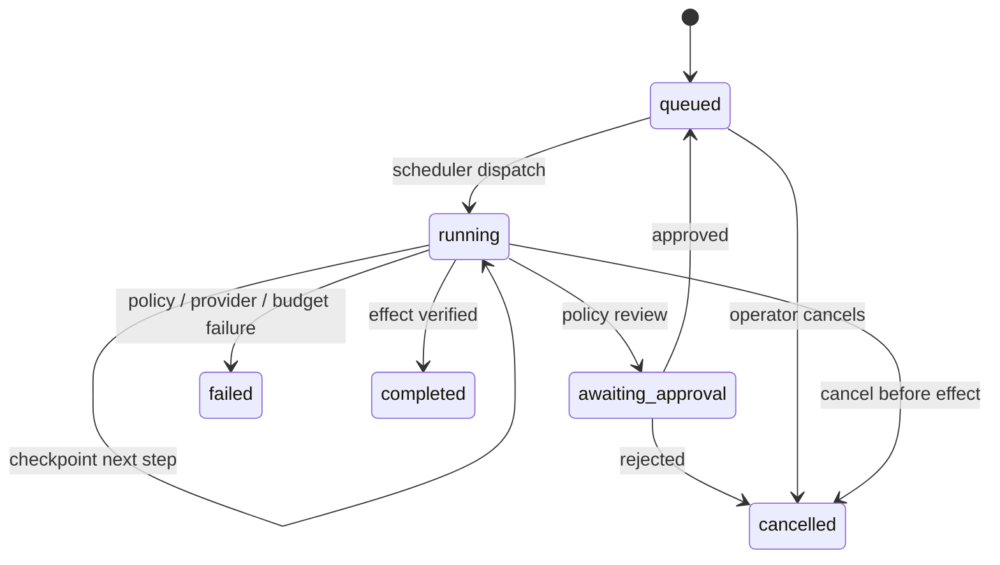

# Architecture and engineering decisions

This document covers the original six-step server workspace. The separate [Razorpay test connector](payments.md) uses persisted external refund intents and provider reconciliation; its verification status is documented explicitly. The public conversational agent has a separate [live inference and tool-loop architecture](live-playground.md).

Relay is intentionally a narrow vertical slice: one operator, customer operations, three allowed actions, one database, and one worker process. The point is to make the authorization and durability boundaries easy to inspect.

## State machine

Each `Run` stores its immutable input, current step, action count, retry count, validated plan, approval decision, outcome, and timestamps. The API never accepts a client-supplied status, plan, or approval as part of mission creation.

## Durability and idempotency

`runs` stores JSON snapshots; `events` stores structured trace entries; `effects` is the sandbox business ledger. `settings` holds the current execution policy. SQLite is configured with WAL and foreign keys.

Each synchronous checkpoint uses `BEGIN IMMEDIATE`. At the action stage, the effect, trace event, and updated step commit together. The ledger has both a primary key and a unique `run_id`. A crash before commit leaves no effect; a crash after commit leaves the next step ready for verification. Model planning is read-only and can be repeated after a crash.

The worker limits each tick to four runnable missions. A per-run in-flight set prevents concurrent ticks within the process from dispatching the same mission twice. This is **not a multi-process lease**. Run one server process per database. Horizontal scaling requires leases, fencing tokens, and atomic claims.

## Approval is scoped to an immutable action

A user approves the run's stored plan and typed request. Those fields have no mutation API. An approval can only be recorded while the run is in `awaiting_approval`; duplicate decisions return HTTP 409. The execution stage rechecks the latest hard limit and workflow capability even after approval.

A model cannot choose the refund amount. That number comes from the validated operator input. A refund action is only permitted in a refund workflow; replacement only in a replacement workflow. A model may choose escalation from any workflow.

The local operator is not authenticated. The `Operator` event label records a role, not a verified person. A production version must attach an authenticated actor, permission scope, and decision provenance.

## Budgets and failure behavior

Every runtime step consumes one action; the demonstration connector can fail once and consume an additional attempt. Before a write, the runtime reserves one action for verification. If a policy edit lowers the budget after a committed effect, verification still finishes rather than leaving an applied action falsely unverified.

Policy denial, malformed model output, model failure, and exhausted budgets fail closed. Provider response bodies are not copied into events. The optional provider has a 20-second timeout and bounded output tokens. There is no generalized retry policy or token-spend accounting yet.

Cancellation checks persisted state after an awaited model response, so late output cannot revive a cancelled mission. Once a business effect has committed, cancellation returns a conflict and lets verification finish; it cannot imply that the effect was rolled back.

## Tools and knowledge

- `customer.lookup`: deterministic synthetic customer context from the operator's request.
- `knowledge.search`: scenario-specific reference citation over three bundled policies.
- `model.plan`: deterministic planner or a configured compatible model endpoint.
- `policy.evaluate`: code-enforced authorization independent of generated prose.
- `sandbox.commit`: idempotent local ledger write.
- `outcome.verify`: verifies the ledger action before marking completion.

Knowledge is bundled reference content, not vector retrieval. Policy settings are authoritative even if the prose in a reference article describes the default thresholds. The UI clearly distinguishes planning context from enforcement.

## Trust boundaries

Customer text is untrusted. It cannot install tools, change the workflow, supply an approval, or write a ledger entry. Schema validation restricts input lengths and enum values; the runtime validates model output before it becomes a plan. The React UI renders content as text, not HTML.

The local API rejects cross-origin browser requests and binds to loopback by default. These controls are not a substitute for authentication, CSRF protection under a session model, network access controls, tenant isolation, or rate limiting in production. The application log is append-only through application methods, not tamper-evident against database administrators.

## What I would build next

1. **Identity and tenancy:** authenticated operators, resource-scoped roles, tenant-keyed rows, integration tests for isolation.
2. **External connector boundary:** transactional outbox, business-level idempotency keys, provider reconciliation, bounded exponential retries, dead-letter states, compensation paths.
3. **Distributed scheduling:** database leases, fencing tokens, fair per-tenant concurrency, cancellation propagation, queue-pressure metrics.
4. **Evaluation discipline:** versioned datasets, model and prompt versions, held-out tool-selection evals, prompt-injection suites against real models, quality and latency gates before rollout.
5. **Production observability:** OpenTelemetry spans, redaction, retention controls, audit exports, calibrated cost and token budgets.
6. **Richer workflows:** a versioned DAG definition, resumable handoffs, actual knowledge retrieval, then voice as another input transport.

Start with measurable reliability improvements in one workflow before generalizing the engine.
