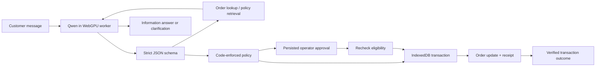

# A live, inspectable agent

[Launch the playground](https://riyadadlani02.github.io/relay-agent-os/?playground=1).

The user types an unconstrained request instead of selecting an encoded scenario. A real language model emits a structured tool call. Relay validates the call, runs the allowed tool, and returns read results to the model. Tool selection and information answers are generated at inference time. Transaction outcomes come directly from persisted receipts or policy decisions, and terminate the turn without letting the model rewrite the result. There is no deterministic model fallback.

## Runtime



`src/playground/kernel.ts` implements the loop. `domain.ts` owns the schema and business rules. `store.ts` serializes mutations through IndexedDB write transactions. `model.ts` loads WebLLM only when the user clicks the download control, then delegates inference to `model-worker.ts` so the interface remains responsive. The compiled runtime is lazy-loaded; model weights are fetched from the WebLLM model registry's Hugging Face URL.

## Real versus sample

| Capability  | What actually happens                                                                                                    |
| ----------- | ------------------------------------------------------------------------------------------------------------------------ |
| Model       | Qwen2.5-1.5B-Instruct-q4f16_1-MLC generates structured decisions and replies on the device                               |
| Retrieval   | Keyword-ranked search across three published policies; source IDs and text are returned                                  |
| Orders      | Reads four fictional orders from the session database                                                                    |
| Refund      | Changes the order's refund state and writes an immutable-in-UI receipt in one IndexedDB transaction                      |
| Replacement | After approval, changes the record and creates a fulfillment-request receipt; no shipment                                |
| Handoff     | Creates a local support ticket receipt; no third-party message                                                           |
| Trace       | Records model identity, tokens, measured latency, actual tool inputs/outputs, policy and operator events                 |
| Persistence | Conversation, pending approval, orders, and receipts survive refresh; inference itself does not run after the tab closes |

The UI does not expose chain-of-thought. The visible evidence is actions and results, not private reasoning text.

## Boundaries enforced outside the model

- Closed tool enum and strict parameter validation. No arbitrary URLs, shell execution, credential access, or model-supplied approvals.
- The JSON grammar narrows to currently available tools: successful retrievals are removed and write tools appear only after prerequisites. A completed action or denial terminates the turn. This prevents a small model from repeatedly selecting the same successful lookup or inventing a success after a denial.
- Explicit order IDs in the current message constrain the tool schema and runtime scope. An order from a previous conversation turn cannot silently become the target of the current request. Information answers referencing a different explicit order are withheld.
- A message without an explicit order ID is read-only: it cannot authorize a refund, replacement, or support ticket. The agent can look up records and ask for the ID before a change. Each retrieval tool gets one attempt per turn; a missing order must lead to clarification, not a lookup loop. Conversation context includes verified runtime outcomes, so completed requests do not appear as unanswered prior user messages.
- A write requires an order lookup and policy retrieval during the current turn.
- Refund amount comes from the stored order, never from generated text or a user-provided amount.
- Delivered within 30 days, not already resolved: up to $100 automatic, $100–$500 operator approval, above $500 denied.
- Replacements always require approval. Approval is bound to the stored action ID and eligibility is rechecked inside the committing transaction.
- Concurrent transactions serialize against the latest order state. The first resolution wins; replay cannot generate a second refund or replacement.
- A turn has at most eight model calls; individual generation has a 90-second timeout and 380 output-token budget. Stop discards a late model response, while preserving any previously committed receipt.

Model-generated information answers can still be inaccurate. Each is accompanied by an explicit notice that no order changes occurred. Transaction results are always runtime receipts, never generated success prose. Prompt injection tests prove the tested code boundaries, not universal model robustness. The small model may choose a poor tool, fail structured generation, or reach its step budget; the UI shows the failure and does not fabricate success.

An answer check rejects numeric claims absent from the retrieved evidence and allows one correction using a clean context containing only the question and source facts. If that also fails, the answer is withheld. This catches unsupported amounts and return windows (for example, an invented “14 days” when the retrieved policy says 30). Accepted policy answers expose their retrieved source IDs. This is a bounded factual check, not a guarantee that every nonnumeric statement is correct.

## Run with a local server model

`npm run dev` also supports the existing `MODEL_BASE_URL`, `MODEL_NAME`, and `MODEL_API_KEY` settings. The endpoint must implement chat completions with JSON-schema output. The UI displays the configured model explicitly. Requests go to the local Express proxy so API keys never enter the frontend.

For an already-installed Ollama model, for example:

```dotenv
MODEL_BASE_URL=http://127.0.0.1:11434/v1
MODEL_NAME=qwen2.5-coder:7b
MODEL_API_KEY=ollama
```

`ollama` is a dummy token accepted by a local Ollama server, not a credential. The server model option is excluded from GitHub Pages. The proxy is local-only by default and has no production authentication or spend controls; do not expose it as a public model gateway. A hosted, zero-download deployment needs authenticated access, request and spend limits, and a server-side provider key.

## Verification and limitations

Unit tests use a model explicitly named “Test fixture (not AI)” to verify hard limits, missing prerequisites, approval replay/rejection, expiry recheck, duplicate refunds, cancellation, and competing IndexedDB transactions. Browser tests verify route styles, records, policy content, responsive layout, and automated accessibility. These tests do not download a model or claim to evaluate its linguistic quality.

Real Qwen inference was also exercised locally in a WebGPU browser: an automatic $49 refund produced a persisted receipt, a $249 refund paused for approval and committed after approval, and an adversarial $750 request was blocked. The first request on a cold model may take substantially longer than later requests while inference and grammar kernels initialize. A policy question also exercised the numeric-answer guard: an invented 14-day window was withheld, and the model regenerated an answer with the correct 30-day window and $100/$500 thresholds from retrieved sources. These are smoke tests, not a measured model-quality benchmark.

Two design decisions came directly from actual model behavior: capability sets narrow after successful reads to prevent repeated retrieval loops, and transaction-result wording is owned by the runtime because a model can produce an incorrect success claim after a rejected action. Explicit order scope and completed-turn context prevent an earlier request from silently becoming the next action target.

The public deployment intentionally depends on WebGPU rather than a billed cloud backend. First load is substantial (about 830 MB of model weights), and device/browser GPU support varies. The cached model still has to initialize after a reload. A visitor who cannot run WebGPU can inspect the source and the labeled deterministic walkthrough.

All data is local to a browser origin. There is no authenticated operator identity, multi-user service, cross-device continuity, or protected audit log. A visitor can modify their own browser data. This is a working portfolio prototype, not a production trust boundary against its own operator.

Sources: [WebLLM basic usage](https://webllm.mlc.ai/docs/user/basic_usage.html), [worker inference](https://webllm.mlc.ai/docs/user/advanced_usage.html), [official model registry](https://github.com/mlc-ai/web-llm/blob/main/src/config.ts).
